# Decoding the Gauntlet Display

This page focuses on decoding the character sequence used in the TV series [The Mandalorian](https://www.starwars.com/series/the-mandalorian) so it can be used to configure an accurate display for cosplay using a [MandoPuter](https://github.com/Breazile/MandoPuter)

  
  

## A New Font

  

If you look closely you will notice that the font used in the gauntlet is different from what was seen in the original Star Wars Series. At this point we lack a complete reference for the font, but we do know 14 characters from the [challenge coin](https://www.bobafettfanclub.com/multimedia/daily/1866/). 

In addition, we have seen one new character on the gauntlet display 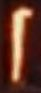, but are not 100% sure which character this maps to, but I'm assuming it is a J until we have a better reference.

There are a couple of alternate fonts being made that closely match the new type style. They are over on [AurekFonts](https://aurekfonts.github.io/):

[MandoAF](https://aurekfonts.github.io/?font=MandoAF) (the L glyph is not consistent with the challenge coin L)
[Mando Alban's Bane BETA](https://aurekfonts.github.io/?font=AlbansBane) (the L glyph is not consistent with the challenge coin L)

The MandoAF font is based on the [Star Wars: The Mandalorian: The Ultimate Visual Guide](https://starwars.fandom.com/wiki/Star_Wars:_The_Mandalorian:_The_Ultimate_Visual_Guide), and has better typeface spacing compared to Mando Alban's Bane (at least for MandoPuter Use). 

I have a modified version of the MandoAF font with the corrected L glyph (upside down V glyph which is consistent with the 2004 font). I call it the [MandoPuter Font](https://github.com/Breazile/MandoPuter/blob/master/MandoPuter.otf). In addition, I have updated the J glyph to an upside down version of the 8 glyph (same as the current L glyph). The glyph was seen on a gauntlet, but we do not know which character this is assigned to. J is my best guess looking at the 2004 font, and was a duplicate of the I glyph in the MandoAF font anyway.

## Original Series Font

  

You can see the font decoded from the original Star Wars series over on the [Erikstormtrooper website](http://www.erikstormtrooper.com/mandalorian.htm). It was decoded from the 2004 Star Wars trilogy DVD set.

This font is useful in trying to decode new characters, or at least making an educated guess of which letter a new font character should be assigned to.

## Font References

  

The [challenge coin](https://www.bobafettfanclub.com/multimedia/daily/1866/) was a big help in the creation of the new font. It has 14 characters listed and spells out "THE MANDALORIAN" and "THIS IS THE WAY"

## Font Glyph Details

The MandoPuter column shows the gliphs that I am using in the MandoPuter distribution and is the most accurate font that I am aware of.

ABC | Coin | MandoPuter | 2004 | Notes
--- | ---- | --- | --- | -----
A |  |  |  |
B | |  |  | |
C | |  |  | |
D |  |  |  |
E |  |  |  |
F | |  |  | |
G | |  |  | |
H |  |  |  |
I |  |  |  |
J | |  |  | My best guess based on the 2004 font. MandoAF and Mando Alban's Bane BETA uses a duplication of the I glyph
K | |  |  | |
L |  |  |  | Glyph is incorrect in MandoAF and Mando Alban's Bane BETA
M |  |  |  |
N |  |  |  |
O |  |  |  |
P | |  |  | |
Q | |  |  | |
R |  |  |  |
S |  |  |  |
T |  |  |  |
U | |  |  | |
V | |  |  | |
W |  |  |  |
X | |  |  | A duplication of the W glyph in MandoAF and Mando Alban's Bane BETA
Y |  |  |  |
Z | |  |  | |
1 | | 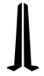 | 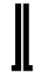 | |
2 | | 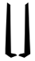 | 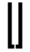 | |
3 | | 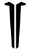 | 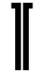 | |
4 | | 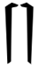 | 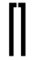 | |
5 | | 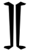 | 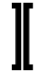 | |
6 | | 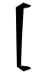 | 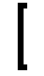 | |
7 | |  | 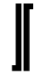 | |
8 | | 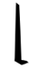 | 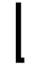 | |
9 | | 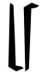 | 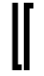 | |
0 | | 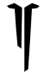 | 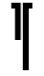 | |

## Screen References

### The Mandalorian Season 1

Sequences from The Mandalorian episodes - work in progress coming soon

Episode | From | To | Sequence | Notes
--- | ---- | --- | --- | -----
Episode #1 - The Mandalorian | 02:11 | 02:16 | ??? | Blury and a lot of motion. Display refresh vs camera frame rate artifacts
Episode #1 - The Mandalorian | 02:22 | 02:29 | ??? | Blury and a lot of motion. Display refresh vs camera frame rate artifacts
Episode #1 - The Mandalorian | 02:46 | 03:22 | ??? | Out of focus, but you can get some timing information on sequence changes
Episode #1 - The Mandalorian | 07:05 | 07:06 | ??? | Out of focus
Episode #1 - The Mandalorian | 10:55 | 10:58 | ??? | Out of focus
Episode #1 - The Mandalorian | 11:39 | 11:43 | ??? | Out of focus, but you can get some timing information on sequence changes
Episode #1 - The Mandalorian | 12:06 | 12:07 | ??? | Out of focus
Episode #1 - The Mandalorian | 12:16 | 12:20 | ??? | Out of focus, but you can get some timing information on sequence changes
Episode #1 - The Mandalorian | 13:02 | 13:04 | ??? | Out of focus
Episode #1 - The Mandalorian | 18:20 | 18:40 | ??? | Out of focus
Episode #1 - The Mandalorian | 19:24 | 19:35 | ??? | Out of focus
Episode #1 - The Mandalorian | 24:09 | 24:38 | ??? | Out of focus, but you can get some timing information on sequence changes
Episode #1 - The Mandalorian | 24:48 | 24:55 | ??? | Out of focus, but you can get some timing information on sequence changes
Episode #1 - The Mandalorian | 35:13 | 35:19 | ??? | Out of focus

### Disney Gallery Star Wars: The Mandalorian

Gauntlet sequences from behind the scenes footage in [Disney Gallery Star Wars: The Mandalorian](https://disneyplusoriginals.disney.com/show/disney-gallery-the-mandalorian). Timestamps are close, and should get you close to when the sequence starts. ??? charaters mean I do not know what they are. Many shots are blurry or too far away to make out clearly.

Episode | From | To | Sequence | Notes
--- | ---- | --- | --- | -----
Episode #3 - Cast | 03:59 | 04:01 | MLM JBM SAS JAS | Assuming the J glyph is correct. Video cuts away after the last sequence and might still be in transition
Episode #3 - Cast | 04:09 | 04:13 | ??? ??? ??? ??? TRH ??? | Small text with some detail missing. Might yield some sequences
Episode #3 - Cast | 04:29 | 04:33 | SAS JBM JRS SAS | Assuming the J glyph is correct. Very clear sequence
Episode #3 - Cast | 04:40 | 04:41 | ??? | Hard to make out, display refresh vs camera frame rate artifacts
Episode #3 - Cast | 09:27 | 09:29 | ??? TRH | Small and slightly out of focus
Episode #3 - Cast | 09:51 | 09:55 | ??? | Small and out of focus

## Current MandoPuter Sequence

Work in progress, coming soon

## Contributions

Thanks to **Luke Dailey** for starting the conversation and sparking renewed interest in finding the sequence. Also thanks to Luke for pointing me to the AurekFont fonts.

Thanks to **Aldo Andrei** for pouring through video clips and putting together the most accurate sequence for the MandoPuter.

Thanks to the many folks in the Mandalorian Facebook groups who are always willing to pitch in and help: 

- [The Mandalorian (costume and prop builders)](https://www.facebook.com/groups/495779494260405)
- [The MANDALORIAN- Din Djarin Costumers Guild](https://www.facebook.com/groups/594812984625855)
- [The Mandalorian - Costuming Group](https://www.facebook.com/groups/1175965535908616)
- [Mandalorian Costuming](https://www.facebook.com/groups/mandaloriancostuming)
