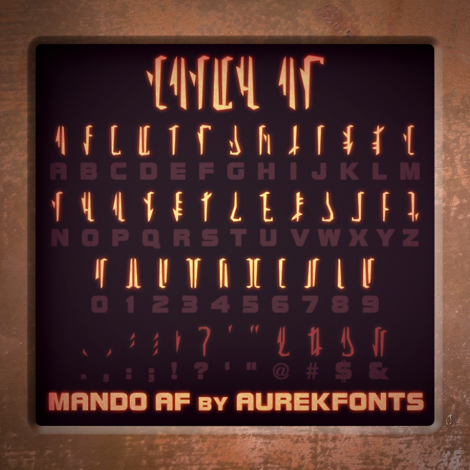
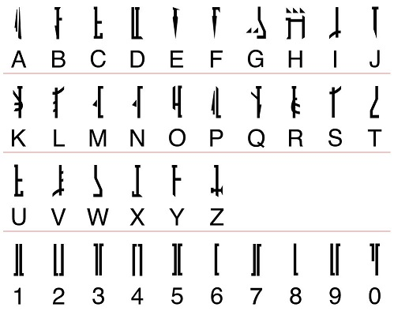

# Decoding the Gauntlet Display

This page focuses on decoding the character sequence used in the TV series [The Mandalorian](https://www.starwars.com/series/the-mandalorian) so it can be used to configure an accurate display for cosplay using a [MandoPuter](https://github.com/Breazile/MandoPuter)

<div align="center">
  
  
</div>

## A New Font

<div align="center">
  
</div><br>

If you look closely you will notice that the font used in the gauntlet is different from what was seen in the original Star Wars Series. At this point we lack a complete reference for the font, but we do know 14 characters from the [challenge coin](https://www.bobafettfanclub.com/multimedia/daily/1866/). 

There are a couple of alternate fonts being made that closely match the new type style. They are over on [AurekFonts](https://aurekfonts.github.io/):

[MandoAF](https://aurekfonts.github.io/?font=MandoAF) (recently updated and accurate)
[Mando Alban's Bane BETA](https://aurekfonts.github.io/?font=AlbansBane) (the L glyph is not consistent with the challenge coin L)

The MandoAF font is based on the [Star Wars: The Mandalorian: The Ultimate Visual Guide](https://starwars.fandom.com/wiki/Star_Wars:_The_Mandalorian:_The_Ultimate_Visual_Guide), and has better typeface spacing compared to Mando Alban's Bane (at least for MandoPuter Use). 

I have a modified version of the MandoAF font with the corrected L glyph (upside down V glyph which is consistent with the 2004 font). I call it the [MandoPuter Font](https://github.com/Breazile/MandoPuter/blob/master/MandoPuter.otf). In addition, I have updated the J glyph to an upside down version of the 8 glyph (same as the current L glyph). The glyph was seen on a gauntlet, but we do not know which character this is assigned to. J is my best guess looking at the 2004 font, and was a duplicate of the I glyph in the MandoAF font anyway. As of 12/1 the [MandoAF font](https://aurekfonts.github.io/?font=MandoAF) has been updated and is accurate.

## Original Series Font

<div align="center">
  
</div><br>

You can see the font decoded from the original Star Wars series over on the [Erikstormtrooper website](http://www.erikstormtrooper.com/mandalorian.htm). It was decoded from the 2004 Star Wars trilogy DVD set.

This font is useful in trying to decode new characters, or at least making an educated guess of which letter a new font character should be assigned to.

## Font References

<div align="center">
  
</div><br>

The [challenge coin](https://www.bobafettfanclub.com/multimedia/daily/1866/) was a big help in the creation of the new font. It has 14 characters listed and spells out "THE MANDALORIAN" and "THIS IS THE WAY"

<div align="center">
  
</div><br>

[Star Wars GMK Boba Fett Keycap Set](https://novelkeys.xyz/products/gmk-boba-fett?fbclid=IwAR33aMgfqw7RKZtgfCL-GTCeDufoT0leXN_aPK07IK3nIoEyq8Nl-IeSJ9g) is officially licensed, and has the full alphabet and numerals. 

## Font Glyph Details
This is the modified font sheet for the characters used in the [MandoPuter Font](https://github.com/Breazile/MandoPuter/blob/master/MandoPuter.otf). The graphic is a modified version of [Mando Alban's Bane [BETA]](https://aurekfonts.github.io/?font=AlbansBane) font sheet with a couple of characters changed according to the table below.

<div align="center">
  <a href="https://aurekfonts.github.io/?font=AlbansBane">
    
  </a>
</div><br>

ABC | Coin | MandoAF | 2004 | Notes
:---: | :----: | :---: | :-------: | :-----
A |  |  |  |
B | |  |  | |
C | |  |  | |
D |  |  |  |
E |  |  |  |
F | |  |  | |
G | |  |  | |
H |  |  |  |
I |  |  |  |
J | |  |  | Consistent with the licensed [Boba Fett keyset](https://novelkeys.xyz/products/gmk-boba-fett?fbclid=IwAR33aMgfqw7RKZtgfCL-GTCeDufoT0leXN_aPK07IK3nIoEyq8Nl-IeSJ9g). MandoAF and Mando Alban's Bane BETA uses a duplication of the I glyph
K | |  |  | |
L |  |  |  | Consistent with the licensed [Boba Fett keyset](https://novelkeys.xyz/products/gmk-boba-fett?fbclid=IwAR33aMgfqw7RKZtgfCL-GTCeDufoT0leXN_aPK07IK3nIoEyq8Nl-IeSJ9g). Glyph does not match the challenge coin in MandoAF and Mando Alban's Bane BETA
M |  |  |  |
N |  |  |  |
O |  |  |  |
P | |  |  | |
Q | |  |  | |
R |  |  |  |
S |  |  |  |
T |  |   |  |
U | |  |  | |
V | |  |  | |
W |  |  |  |
X | |  |  | A duplication of the W glyph in MandoAF and Mando Alban's Bane BETA. I updated the character, compare with the licensed [Boba Fett keyset](https://novelkeys.xyz/products/gmk-boba-fett?fbclid=IwAR33aMgfqw7RKZtgfCL-GTCeDufoT0leXN_aPK07IK3nIoEyq8Nl-IeSJ9g)
Y |  |  |  |
Z | |  |  | |
0 | |  |  | 
1 | |  |  | |
2 | |  |  | 
3 | |  |  | |
4 | |  |  | 
5 | |  |  | |
6 | |  |  | |
7 | |  |  | |
8 | |  |  | |
9 | |  |  | 

## Screen References

Sequences from [The Mandalorian](https://disneyplusoriginals.disney.com/show/the-mandalorian-season-two) episodes - work in progress coming soon. ??? characters means the glyphs have not been identified for the clip.

Aldo Andrei has a series of [screen shot references](https://drive.google.com/drive/folders/1wWAuCdXD1zziuuL0JHsdwfN0YArSGwSH?fbclid=IwAR2J7ZZtnIAeWz4L0-GKN9WZldhnyJyeQexEbnaR8NvwbWtNvKTA75XlhL4) that he used to decipher the sequence.

### The Mandalorian Season 1

#### Episode 1: The Mandalorian
Aldo's [chapter 1 reference photos](https://drive.google.com/drive/folders/1swK1esfEmthlURmXpM_0WOLcCqxhGoKq?fbclid=IwAR2J7ZZtnIAeWz4L0-GKN9WZldhnyJyeQexEbnaR8NvwbWtNvKTA75XlhL4)
From | To | Sequence | Notes
:----: | :--: | :-------- | :-----
02:11 | 02:16 | ??? | Blury and a lot of motion. Display refresh vs camera frame rate artifacts
02:22 | 02:29 | ??? | Blury and a lot of motion. Display refresh vs camera frame rate artifacts
02:46 | 03:22 | ??? | Out of focus, but you can get some timing information on sequence changes
07:05 | 07:06 | ??? | Out of focus
10:55 | 10:58 | ??? | Out of focus
11:39 | 11:43 | ??? | Out of focus, but you can get some timing information on sequence changes
12:06 | 12:07 | ??? | Out of focus
12:16 | 12:20 | ??? | Out of focus, but you can get some timing information on sequence changes
13:02 | 13:04 | ??? | Out of focus
18:20 | 18:40 | ??? | Out of focus
19:24 | 19:35 | ??? | Out of focus
24:09 | 24:38 | ??? | Out of focus, but you can get some timing information on sequence changes
24:48 | 24:55 | ??? | Out of focus, but you can get some timing information on sequence changes
35:13 | 35:19 | ??? | Out of focus

#### Episode 2: The Child
Aldo's [chapter 2 reference photos](https://drive.google.com/drive/folders/19_joNALRXmZ0RZkLahTr4ymLmGqrgb8f?fbclid=IwAR2J7ZZtnIAeWz4L0-GKN9WZldhnyJyeQexEbnaR8NvwbWtNvKTA75XlhL4)
From | To | Sequence | Notes
:----: | :--: | :-------- | :-----
02:44 | 02:48 | DSC SAS TRH | Out of focus, best guess
04:42 | 04:46 | ??? | Out of focus
09:55 | 09:66 | ??? ??? | Out of focus, two sequences
10:11 | 10:15 | SAS DSC SAS | Out of focus, at least three sequences
10:21 | 10:24 | ??? ??? | Out of focus, at least two sequences
13:29 | 13:37 | ??? ??? | Out of focus, at least two sequences
17:04 | 17:05 | ??? ??? A?? | Out of focus
17:27 | 17:30 | ??? SAS DSC | Out of focus, at least two sequences
21:32 | 21:37 | MLM ?RS TRH | Out of focus, at least two or three sequences
24:27 | 24:39 | ??? TLH ACS | Out of focus
24:48 | 24:53 | SAS LRS MLM SAS AJS SAS ASJ | Scene is mirrored

#### Episode 3: The Sin
Aldo's [chapter 3 reference photos](https://drive.google.com/drive/folders/1eAsgTT-6jYLOxwtb3QXkWl923olwmWEJ?fbclid=IwAR2J7ZZtnIAeWz4L0-GKN9WZldhnyJyeQexEbnaR8NvwbWtNvKTA75XlhL4)
From | To | Sequence | Notes
:----: | :--: | :-------- | :-----
06:29 | 06:35 | SAS TRH SAS ??? | Last sequence not clear
08:21 | 08:26 | ??? | Out of focus
08:46 | 08:55 | ??? | Out of focus
09:19 | 09:23 | ??? | Out of focus, but you can get some timing information on sequence changes
10:19 | 10:24 | ??? | Out of focus, but you can get some timing information on sequence changes
11:22 | 11:30 | ??? | Out of focus, but you can get some timing information on sequence changes
14:47 | 14:50 | ??? ??? ??? | The first time we see the Beskar gauntlet
14:58 | 15:03 | ??? | Out of focus
15:30 | 15:34 | ??? | Has some timing information
15:51 | 16:02 | TRH ??? | Good sequence to decode on a large TV
16:11 | 16:26 | ??? ??? | Has some timing information
20:09 | 20:12 | ??? | 
20:26 | 20:30 | JBM | 
21:21 | 21:23 | ??? TRH | 
21:47 | 21:50 | ??? ??? | Various other short views in the rescue scene up to the whistling birds
23:55 | 24:01 | ??? | 
28:34 | 28:35 | ??? | 
29:59 | 30:01 | TRH | 
30:16 | 30:12 | TRH SAS MLM | SAS is shown for only 2 frames
30:16 | 30:18 | DSC JAS ??? | Could be SAS instead of JAS
30:43 | 30:49 | ??? ??? | 
30:55 | 30:57 | ??? TRH ??? | 
31:06 | 30:13 | ??? TRH ??? | Out of focus

#### Episode 4: Sanctuary
Aldo's [chapter 4 reference photos](https://drive.google.com/drive/folders/1jveO9QAg7G04ztGc1VbWdDoTZa8-FuQL?fbclid=IwAR2J7ZZtnIAeWz4L0-GKN9WZldhnyJyeQexEbnaR8NvwbWtNvKTA75XlhL4)
From | To | Sequence | Notes
:----: | :--: | :-------- | :-----
05:59 | 06:00 |  | 
07:04 | 07:07 |  | 
07:33 | 07:33 |  | 
07:35 | 07:37 |  | 
07:49 | 07:50 |  | Timing
07:55 | 07:58 |  | Hard to make out, but timing
08:11 | 08:11 |  |
10:05 | 10:08 |  | Good reference for sequence timing/cycling
10:14 | 10:16 |  | Good reference for sequence timing/cycling
10:27 | 10:28 |  | Hard to make out, 2 strings
10:44 | 10:45 |  | Angle hard to make out
12:49 | 12:51 |  | Blurry and angled when clear shot
13:17 | 13:19 |  | Angle makes it hard to decipher. Cant tell if "twitch" cycling is video glitch or new sequence
13:26 | 13:27 |  | 
14:47 | 14:47 |  | Blurry until he stops his turn for about ~4 frames
14:55 | 15:05 |  | This would of been perfect had it not been for focus blur. You can make out the timing for what I believe might be the full sequence
16:28 | 16:29 |  | 
16:33 | 16:34 |  | Few frames fisible with swing of hand
17:08 | 17:10 | (JQS/SQS/JQJ?) DS(T/C?) SAS TLH MLM  | Quick cycle of 5 or 6 Ehns
17:45 | 17:48 | TLH JRS JAS(This is the Ehn that lasts for about 0.15) SAS AJS TLH JAS | Yet another visible sequence. Here we can see the really short "twitch" from one Ehn to another before continuting the sequence
18:21 | 18:26 |  | Same as previous. There is a frame that the Mandoputer becomes too blurred to see. Assuming a consistent patterm, My best guess would be that the blurred Ehn is TLH followed by a visible MLM. Going back to Chapter 3, we can assume DCS and LBM follows
18:41 | 18:43 |  | 
18:47 | 19:00 | AJS JB(?)M JAS JB(?)M MLM JB(?)M AJS JB(?)M SAS DSC | We get a good and long shot of the mandoputer and its sequence. Its fairly clearn until the very end when the camera shifts focus
22:10 | 22:16 |  | A lot of frames on this one are blurry the first few seconds) TLH JRS JAS SAS | Yet another long take with the mandoputer visible. Too blurry to see but able to make out certain characters by looking at their rough shape and using previous Ehn sequences

#### Episode 5: The Gunslinger
Aldo's [chapter 5 reference photos](https://drive.google.com/drive/folders/1aXWwlyvjc-GVor2acgAN7btPjlr50DzW?fbclid=IwAR2J7ZZtnIAeWz4L0-GKN9WZldhnyJyeQexEbnaR8NvwbWtNvKTA75XlhL4)
From | To | Sequence | Notes
:----: | :--: | :-------- | :-----
05:59 | 06:00 | ??? | 
02:41 | 02:42 | SAS JAS JRS | Significant amount of motion blur. Some Ehns are discernable
03:02 | 03:03 | ??? | Out of focus
03:06 | 03:06 | | Lots of motion blur. ?SC can be made out. Since we know repeating Ehns are a thing, one can assume it is DSC
04:20 | 04:22 | JAS | Cant tell if its just artifacting from the video or if the Ehns go over a JRS JAS(0.15) "twitch" cycle
04:31 | 04:34 |  | Too blurry to make out. We see that the first Ehn transition takes about 0.30 while doing the "twitch/morph" effect. Second quick transition seems to take about the previously established 0.15
09:23 | 09:23 | (AJS?) | Hard to make out
09:26 | 09:27 |  | Out of focus
18:10 | 18:10 |  | Hard to make out. Possibly MLM
18:16 | 18:16 |  | Angle and motion blur make it hard to make out
18:20 | 18:23 | J(?)AS (AJS?) | Angles and focus make it hard to make out. Some chracters discernable
27:00 | 27:06 |  | Long shot. Distance and out of focus makes it hard to discern
28:21 | 28:21 | ??? TLH | Lighting, angle, and focus makes it hard to discern

#### Episode 6: The Prisoner
Aldo's [chapter 6 reference photos](https://drive.google.com/drive/folders/1neDV-l2z18Iqpp8I6YA0VJlvLic9xJUG?fbclid=IwAR2J7ZZtnIAeWz4L0-GKN9WZldhnyJyeQexEbnaR8NvwbWtNvKTA75XlhL4)
From | To | Sequence | Notes
:----: | :--: | :-------- | :-----
03:51 | 03:58 | ??? | 
13:56 | 14:00 | ??? | Can see half of the characters, but they are in focus
15:42 | 15:44 | ??? | 
29:22 | 29:24 | ??? | 
29:57 | 29:58 | ??? | 

### The Mandalorian Season 2

#### Episode 1: The Marshal
Aldo's [chapter 9 reference photos](https://drive.google.com/drive/folders/1pJE7EFN99iIFcg8c4rAqC6mL6O8a86FN?fbclid=IwAR2J7ZZtnIAeWz4L0-GKN9WZldhnyJyeQexEbnaR8NvwbWtNvKTA75XlhL4)
From | To | Sequence | Notes
:----: | :--: | :-------- | :-----
02:40 | 02:48 | (CR)?M LBM SAS TLH LLR SAS D(R?)M JAS JSR JRS | Good walking shot towards the camera. Certain Ehns are not as readable due to the angle and motion blur caused by the sway of his arm
05:15 | 05:18 | JAS LBM AJS ?SC(Assume DSC) JAS LBM | Short shot, some characters get cut off but we can use previous known Ehns to complete these
05:25 | 05:36 | DJN JAS DSJ TLH SAS JRS JSR JRS JSR GWL DR(?)M JRS T(?)LH SAS JRS (DRM?) | We get a decent shot, although out of focus, we can still make out a few Ehns. Towards the end, there is a new sequence we have not seen before. Certain characters appear incomplete and cut as seen on the 0525TLHcorrupt screenshot and 0525Unk. This could also be due to angle and out of focus
10:21 | 10:26 | TLH JKN JBM JRS JKN DCN GWL JRS DCW | Good shot, we can see new Ehns that confirm some in previous time stamp
10:48 | 10:51 | DCN TLH GWL JSR | 
11:19 | 11:19 | ??? DCW SAS JSR | Pan up shot. Unk Ehn before transitioning to DCW
14:25 | 14:28 | JRS JRF AJS JRN | Here we can see how JRF has a substancially longer "nose" than when JRN. Second opinions on this might be needed

### Disney Gallery Star Wars: The Mandalorian

Gauntlet sequences from behind the scenes footage in [Disney Gallery Star Wars: The Mandalorian](https://disneyplusoriginals.disney.com/show/disney-gallery-the-mandalorian). Timestamps are close, and should get you close to when the sequence starts. ??? charaters mean I do not know what they are. Many shots are blurry or too far away to make out clearly.

Episode | From | To | Sequence | Notes
:-------: | :----: | :--: | :---------------- | :-----
#3 | 03:59 | 04:01 | MLM JBM SAS JAS | Assuming the J glyph is correct. Video cuts away after the last sequence and might still be in transition (Beskar)
#3 | 04:09 | 04:13 | ??? TRH ??? | Small text with some detail missing. Might yield some sequences  (Beskar)
#3 | 04:29 | 04:33 | SAS JBM JRS SAS | Assuming the J glyph is correct. Very clear sequence  (no Beskar)
#3 | 04:40 | 04:41 | ??? | Hard to make out, display refresh vs camera frame rate artifacts  (Beskar)
#3 | 09:27 | 09:29 | ??? TRH | Small and slightly out of focus  (Beskar)
#3 | 09:51 | 09:55 | ??? | Small and out of focus  (Beskar)

## Current MandoPuter Sequences that have been decoded (work in progress)

**Episode 2: The Child - 24:48**
```
messages = [ "SAS", "LRS", "MLM", "SAS", "AJS", "SAS", "ASJ"]
delays =   [  0.80,  0.25,  0.84,  1.00,  0.25,  0.80, 0.84 ]
```

**Episode 3: The Sin - 06:29**
```
messages = [ "SAS", "TRH", "SAS"]
delays =   [  1.00,  0.67,  1.00]
```

**Disney Gallery Star Wars: The Mandalorian episode #3 - 03:59**
```
messages = [ "MLM", "JBM", "SAS", "JAS"]
delays =   [  0.75,  0.75,  0.65, 0.75 ]
```

## Contributions

Thanks to **Luke Dailey** for starting the conversation and sparking renewed interest in finding the sequence. Also thanks to Luke for pointing me to the AurekFont fonts.

Thanks to **Aldo Andrei** for pouring through video clips and putting together the most accurate sequence for the MandoPuter.

Thanks to the many folks in the Mandalorian Facebook groups who are always willing to pitch in and help: 

- [The Mandalorian (costume and prop builders)](https://www.facebook.com/groups/495779494260405)
- [The MANDALORIAN- Din Djarin Costumers Guild](https://www.facebook.com/groups/594812984625855)
- [The Mandalorian - Costuming Group](https://www.facebook.com/groups/1175965535908616)
- [Mandalorian Costuming](https://www.facebook.com/groups/mandaloriancostuming)
