# Decoding the Gauntlet Display

This page focuses on decoding the character sequence used in the TV series [The Mandalorian](https://www.starwars.com/series/the-mandalorian) so it can be used to configure an accurate display for cosplay using a [MandoPuter](https://github.com/Breazile/MandoPuter)

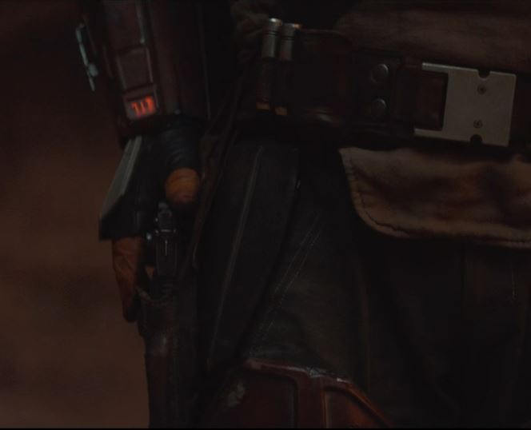 
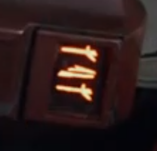 

## A New Font

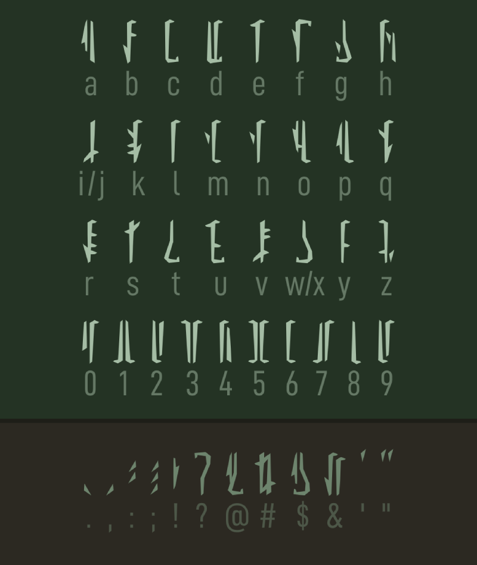

If you look closely you will notice that the font used in the gauntlet is different from what was seen in the original Star Wars Series. At this point we lack a complete reference for the font, but we do know 14 characters from the [challenge coin](https://www.bobafettfanclub.com/multimedia/daily/1866/). 

In addition, we have seen one new character on the gauntlet display, but are not 100% sure which character this maps to.

There are a couple of alternate fonts being made that closely match the new type style. They are over on [AurekFonts](https://aurekfonts.github.io/):

[MandoAF](https://aurekfonts.github.io/?font=MandoAF) (the L glyph is not consistent with the challenge coin L)
[Mando Alban's Bane BETA](https://aurekfonts.github.io/?font=AlbansBane) (the L glyph is not consistent with the challenge coin L)

The MandoAF font is based on the [Star Wars: The Mandalorian: The Ultimate Visual Guide](https://starwars.fandom.com/wiki/Star_Wars:_The_Mandalorian:_The_Ultimate_Visual_Guide), and has better typeface spacing compared to Mando Alban's Bane (at least for MandoPuter Use). 

I have a modified version of the MandoAF font with the corrected L glyph (upside down V glyph which is consistent with the 2004 font). I call it the [MandoPuter Font](https://github.com/Breazile/MandoPuter/blob/master/MandoPuter.otf). In addition, I have updated the J glyph to an upside down version of the 8 glyph (same as the current L glyph). The glyph was seen on a gauntlet, but we do not know which character this is assigned to. J is my best guess looking at the 2004 font, and was a duplicate of the I glyph in the MandoAF font anyway.

## Original Series Font

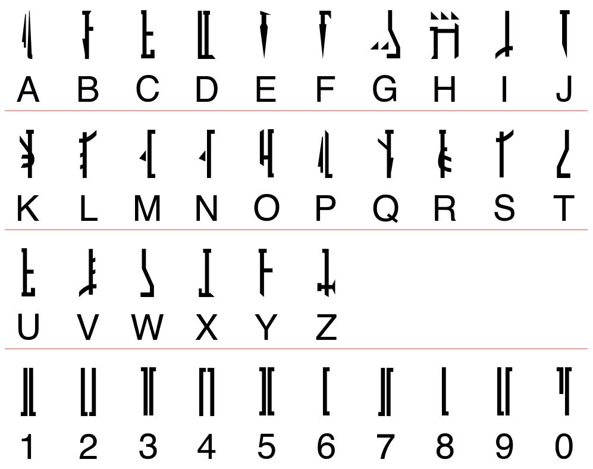

You can see the font decoded from the original Star Wars series over on the [Erikstormtrooper website](http://www.erikstormtrooper.com/mandalorian.htm). It was decoded from the 2004 Star Wars trilogy DVD set.

This font is useful in trying to decode new characters, or at least making an educated guess of which letter a new font character should be assigned to.

## Off Screen References

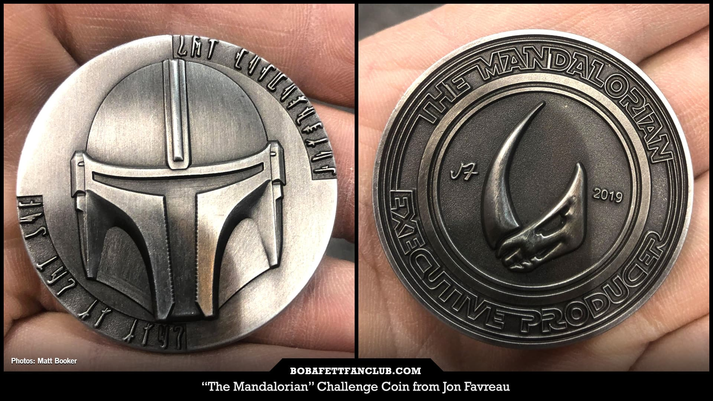

The [challenge coin](https://www.bobafettfanclub.com/multimedia/daily/1866/) was a big help in the creation of the new font. It has 14 characters listed and spells out "THE MANDALORIAN" and "THIS IS THE WAY"

ABC | Coin | 2019 | 2004
--- | ---- | --- | ---
A | 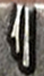 | 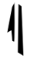 | 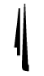
B | | 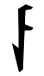 | 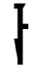
C | | 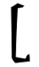 | 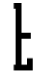
D | 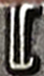 | 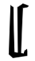 | 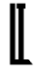
E | 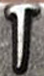 | 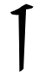 | 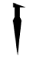
F | | 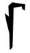 | 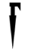
G | | 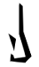 | 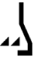
H | 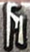 | 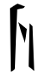 | 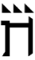
I | 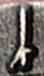 | 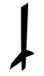 | 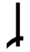
J | | 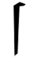 | 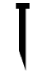
K | | 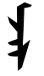 | 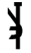
L | 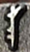 | 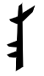 | 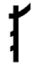
M | 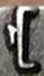 | 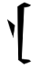 | 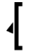
N | 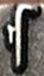 | 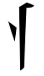 | 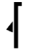
O | 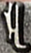 | 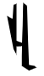 | 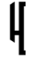
P | | 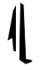 | 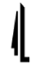
Q | | 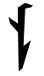 | 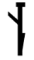
R | 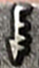 |  | 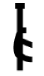
S |  |  | 
T |  |  | 
U | |  | 
V | |  | 
W |  |  | 
X | |  | 
Y |  |  | 
Z | |  | 

## Screen References

Gauntlet sequences seen in [Disney Gallery Star Wars: The Mandalorian](https://disneyplusoriginals.disney.com/show/disney-gallery-the-mandalorian). Timestamps are close, but may not be exact to your clip. It should get you close and you can go frame by frame if possible. ??? charaters mean I do not know what they are. Many shots are blurry or too far away to make out clearly.

Episode | From | To | Sequence | Notes
--- | ---- | --- | --- | -----
Episode #3 - Cast | 03:59 | 04:01 | MLM JBM SAS JAS | Assuming the J glyph is correct. Video cuts away after the last sequence might still be in transition
Episode #3 - Cast | 04:09 | 04:13 | ??? ??? ??? ??? TRH ??? | 
Episode #3 - Cast | 04:29 | 04:33 | SAS JBM JRS SAS | Assuming the J glyph is correct
Episode #3 - Cast | 04:40 | 04:41 | ??? | 
Episode #3 - Cast | 09:27 | 09:29 | ??? TRH | 
Episode #3 - Cast | 09:51 | 09:55 | ??? | 
Episode #3 - Cast | 20:06 | 20:07 | ??? | 

## Current MandoPuter Sequence

TBD
