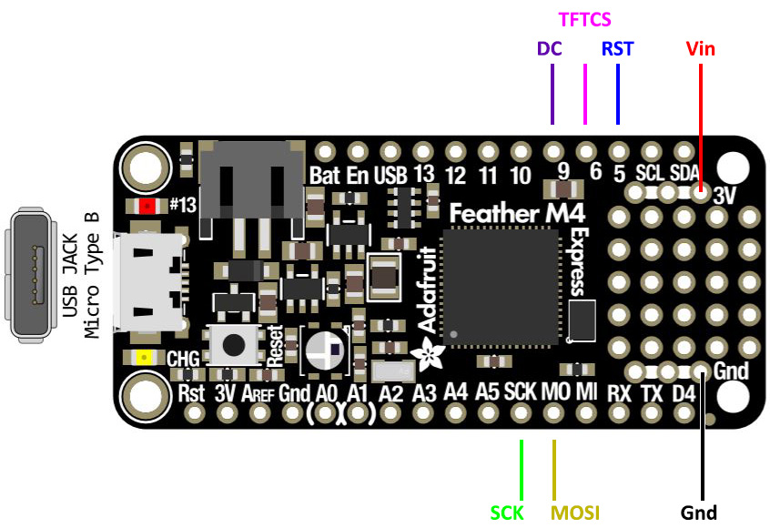
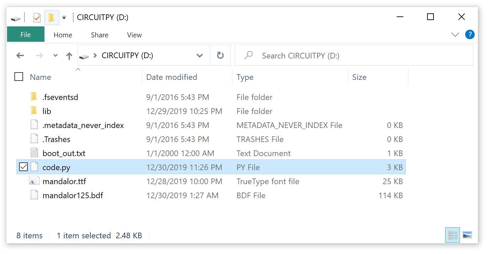
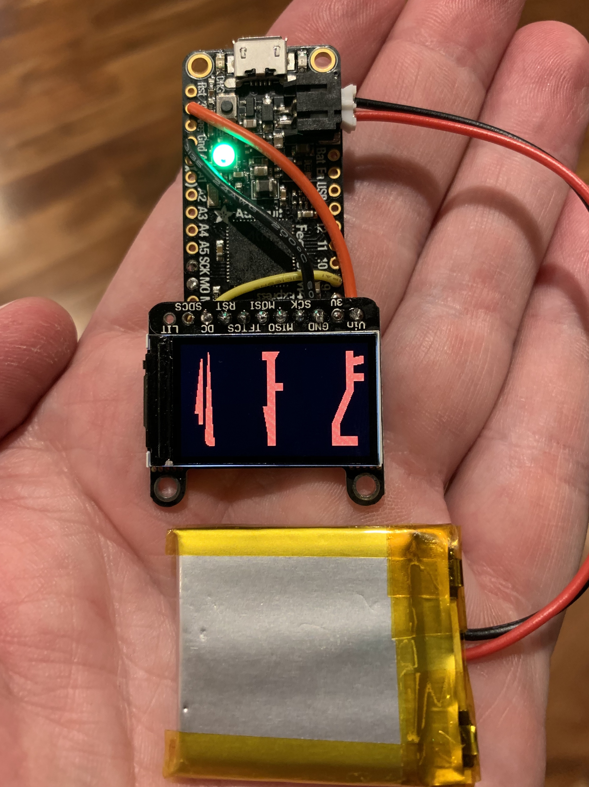

# What is a MandoPuter?

A basic electronics system that will display Mandalorian characters on a small display (I'm paying homage to Lego Batman with the name "Puter"). Use this as a starting point for adding displays to your costume (like a gauntlet). Feel free to copy the design, modify it, or make feature requests. This is the way!

## Parts list:

You will need the following parts:

1) One supported display [0.96" LCD](https://www.adafruit.com/product/684),  [1.14" LCD](https://www.adafruit.com/product/4383),  [1.27" OLED](https://www.adafruit.com/product/1673),  [1.3" LCD](https://www.adafruit.com/product/4313),  [1.44" LCD](https://www.adafruit.com/product/2088),  [1.5" OLED](https://www.adafruit.com/product/1431),  [1.54" LCD](https://www.adafruit.com/product/3787),  [1.8" LCD](https://www.adafruit.com/product/358)
2) [Feather M4 Express Board](https://www.adafruit.com/product/3857) (support for an [ItsyBitsy M4 Express](https://www.adafruit.com/product/3800) is in the code, but not yet tested)
3) 4.2/3.7V [Battery](https://www.adafruit.com/category/917) (my 500 mAh battery in the picture below ran for over 12 hours)
4) Small Gauge (22-30) [Wire](https://www.amazon.com/Stranded-Nano-Flexible-Insulated-Electrical/dp/B07DCV7BDD/ref=sr_1_1_sspa?keywords=24+gauge+wire&qid=1577768346&sr=8-1-spons&psc=1&spLa=ZW5jcnlwdGVkUXVhbGlmaWVyPUEzR1IxUzhXVlJRMFoxJmVuY3J5cHRlZElkPUEwMjE2ODM0MTRRSVkyQlBIRTZJSiZlbmNyeXB0ZWRBZElkPUEwNzE2MTQ1UURZTURJT0VDUEMzJndpZGdldE5hbWU9c3BfYXRmJmFjdGlvbj1jbGlja1JlZGlyZWN0JmRvTm90TG9nQ2xpY2s9dHJ1ZQ==) 
5) Velcro for the battery

If you have an ItsyBitsy, or want to add a switch to the battery, get these 2 parts:

1) Switch [breakout board](https://www.adafruit.com/product/1863)
2) Two pin [battery pigtail](https://www.adafruit.com/product/261)

Solder the pigtail cable cable to the board (black to one of the GND holes, red to the SW hole). Do not connect red to the + hole, that is not switched. Plug the battery into the breakout board, and the pigtail into the Feather M4. If you are using an ItsyBitsy solder the wires to the BAT and G pins on the board. Red goes to BAT, black goes to G.

## Recommended Tools:

1) Fine tip [Soldering Iron](https://www.amazon.com/Hakko-FX888D29BY-ESD-Safe-Digital-Soldering/dp/B00OSM27T8?ref_=ast_bbp_dp) (I use a Hakko FX-100, but any fine tip will work)
2) Solder ([what I'm using](https://www.amazon.com/gp/product/B00FGHTZFI/ref=ppx_yo_dt_b_search_asin_title?ie=UTF8&psc=1))
3) Solder flux ([what I'm using](https://www.amazon.com/gp/product/B01N8ZX7ZQ/ref=ppx_yo_dt_b_search_asin_title?ie=UTF8&psc=1))
4) [Micro Cutters](https://www.amazon.com/gp/product/B0765NMV68/ref=ppx_yo_dt_b_search_asin_title?ie=UTF8&psc=1)
5) [Wire Strippers](https://www.amazon.com/dp/B000XEUPMQ/ref=twister_B07JCDW6X6?_encoding=UTF8&psc=1)
6) [Tweezers](https://www.amazon.com/gp/product/B01MA5CCDO/ref=ppx_yo_dt_b_search_asin_title?ie=UTF8&psc=1)
7) [Isopropyl Alcohol](https://www.amazon.com/gp/product/B005DNQX3C/ref=ppx_yo_dt_b_search_asin_title?ie=UTF8&psc=1) for cleaning solder flux
8) A computer with a USB port
9) Micro USB [Cable](https://www.amazon.com/AmazonBasics-Male-Micro-Cable-Black/dp/B0711PVX6Z/ref=sxin_2_ac_d_rm?ac_md=0-0-bWljcm8gdXNiIGNhYmxl-ac_d_rm&keywords=micro+USB+cable&pd_rd_i=B0711PVX6Z&pd_rd_r=0c98cacf-0fa0-4c33-a20e-4d50696b8c55&pd_rd_w=EvHyD&pd_rd_wg=74RAP&pf_rd_p=e2f20af2-9651-42af-9a45-89425d5bae34&pf_rd_r=DBF2336PKCKSAH0KHNCG&psc=1&qid=1577768200)

## I have the parts, now what do I do?

You'll follow 3 main steps to get things setup:

1) Setup the Feather M4 board with CircuitPython, and make sure it enumerates on your PC
2) Solder the display to the board
3) Copy the files

That's it, no need to write any code or use any other fancy tools. I have the source code here, so you can install CircuitPython and modify the code to suit your needs. More on that in another guide.

### 1. Feather Setup

Setup the Feather M4 first before you start soldering anything. Make sure the basics work just in case you damage the board during soldering. The primary guide to the Feather is [here](https://learn.adafruit.com/adafruit-feather-m4-express-atsamd51), but you can skip ahead to the [CircuitPython setup](https://learn.adafruit.com/adafruit-feather-m4-express-atsamd51/circuitpython). Plugging the Feather into USB will power the board, you don't need a battery yet. If you have the battery connected when powered via USB it will charge. Power management details are [here](https://learn.adafruit.com/adafruit-feather-m4-express-atsamd51/power-management). Do not use alkaline or NiMH batteries and connect to the battery port - this will destroy the LiPoly charger and there's no way to disable the charger. Do not use 7.4V RC batteries on the battery port - this will destroy the board.

When you plug the Feather into your computer, it should show up just like a USB key and you copy file to it in the same way. No need to download anything, drag and drop.

Use CircuitPython V4, which you can get from [here](https://circuitpython.org/board/feather_m4_express/) and there is a handy guide on [installing CircuitPython](https://learn.adafruit.com/welcome-to-circuitpython/installing-circuitpython)

### 2. Solder the LCD

Solder the LCD to the Feather M4 (or ItsyBitsy), so they can talk to each other. Adafruit has a great [soldering guide](https://learn.adafruit.com/adafruit-guide-excellent-soldering) if you are new to soldering. The only thing they did not mention is adding flux to the solder joint first. That makes it much easier to make a good solder joint, and you only need to touch the parts for a second or two.

Feather Pin | LCD Pin | ItsyBitsy Pin
------------ | ------------- | ------------
3V | Vin (do not use 3V) | 3V
GND | GND | G (also Battery-)
CLK | SCK | SCK
MO | MOSI | MO
5 | RST or RESET | 4
6 | TFTCS or TFT_CS | 2
9 | DC or D/C | 3
 | | Batt - Battery+

Use [this](Adafruit_1-44_Wiring.jpg) wiring diagram if you are using the [Adafruit 1.44" LCD](https://www.adafruit.com/product/2088)

### 3. Copy the files to the Feather

Download and extract the [zip file](MandoPuter.zip) that contains the code, libraries, and bitmap font file. Copy these to the root of the CIRCUITPY drive with the Feather M4 connected to your PC. If your lib folder already exists, do not replace it, just add the files from the ZIP file to the lib folder. It should look something like this (ignore the extra files like boot.out.txt the system creates those).

Make sure you let the copy finish before you remove the USB cable or reset the board, or your system could be corrupted. It could take up to 90 seconds or more on some systems. If that happens, please read the [troubleshooting page](https://learn.adafruit.com/adafruit-feather-m4-express-atsamd51/troubleshooting)

You should be ready to go. The system should run once the copy is done, and you should see the font look like this:

