# What is a MandoPuter?

A basic electronics system that will display Mandalorian characters on a small display (I'm paying homage to Lego Batman with the name "Puter"). Use this as a starting point for adding displays to your costume (like a gauntlet). Feel free to copy the design, modify it, or make feature requests. 

If you need help, have questions or feature requests please click on the [Issues](https://github.com/Breazile/MandoPuter/issues) link near the top of the page. File an issue and I'll receive an email notification.

## Contents
* [Improvements in V2](README.md#Improvements-in-V2)
* [Features under development](README.md#Features-under-development)
* [Parts list](README.md#Parts-list)
* [Which board should I use?](README.md#Which-board-should-I-use)
* [Suggested Tools](README.md#Suggested-Tools)
* [Installation Steps](README.md#Installation-Steps)
    1. [Install the software and files on the board](README.md#Install-the-software-and-files-on-the-board)
    2. [Customize options](README.md#Customize-options)
    3. [Solder the LCD](README.md#Solder-the-LCD)
    4. [Power the board](README.md#Power-the-board)
* [Latest Mandalorian Font](README.md#Latest-Mandalorian-Font)
* [Where can I get help?](README.md#Where-can-I-get-help)
* [Troubleshooting](README.md#Troubleshooting)
* [Want to know more?](README.md#Want-to-know-more)

## Improvements in V2:

* More supported boards (including a Raspberry Pi). This should help with price and availability
* New configurable startup sequence where you can display your name and up to 2 images
* New non-proportionately spaced Mandalorian font for a smoother character transition (no more characters shifting left or right)
* Configurable low battery icon shown on the LCD so you can tell when your battery is running low
* Configurable LCD backlight brightness
* Disabled the onboard LED to save power. You can't see it anyway when installed in a gauntlet
* Refactored the code to make it more RAM efficient and simpler code

## Features under development

* Deep sleep - command the board to sleep for a certain amount of time (or until an external button is pressed)
* Bluetooth - I'm looking into Bluetooth features once Adafruit has completed development
* Audio - playback of audio files (WAV)
* Evaluating board [Adafruit Feather RP2040](https://www.adafruit.com/product/4884)
* Evaluating board [Adafruit ItsyBitsy nRF52840 Express - Bluetooth LE](https://www.adafruit.com/product/4481)

## Parts list

1) One supported display (please contact me if you need other displays):
- [1.14" LCD](https://www.adafruit.com/product/4383)  **<--- preferred display for the GreatApeStudioArt [pre-Beskar](https://www.etsy.com/listing/751008521/the-mandalorian-bracers?ref=shop_home_active_7&crt=1) gauntlet**
- [1.30" LCD](https://www.adafruit.com/product/4313)  **<--- preferred display for the GreatApeStudioArt [Beskar](https://www.etsy.com/listing/765735752/the-mandalorian-beskar-bracers?ref=shop_home_active_8&crt=1) gauntlet**
2) One microcontroller board that supports CircuitPython (see [Which board should I use?](README.md#Which-board-should-I-use) below)
    * [Adafruit ESP32-S3 Feather](https://www.adafruit.com/product/5477) (get the 2MB PSRAM version)
    * [Adafruit Feather M4 Express](https://www.adafruit.com/product/3857)
    * [Adafruit ItsyBitsy M4 Express](https://www.adafruit.com/product/3800)
    * [Adafruit ItsyBitsy RP2040](https://www.adafruit.com/product/4888)
    * [Raspberry Pi Pico RP2040](https://www.adafruit.com/product/4864) alternate sources [here](https://www.raspberrypi.com/products/raspberry-pi-pico/)
3) 3.7V LiPoly Battery, [500 mAh](https://www.adafruit.com/product/1578) or [1200 mAh](https://www.adafruit.com/product/258) are good choices. You can also use a [USB battery bank](https://www.amazon.com/Portable-Battery-Charger-Cell-Phones/dp/B07K6HJTK2/ref=sxin_15_pa_sp_search_thematic_sspa?content-id=amzn1.sym.7970387d-6fd7-44b1-a2dd-2355f5d39187%3Aamzn1.sym.7970387d-6fd7-44b1-a2dd-2355f5d39187&crid=1XF8AIUL7F3WS&cv_ct_cx=slim+USB+battery+bank&keywords=slim+USB+battery+bank&pd_rd_i=B07K6HJTK2&pd_rd_r=f0075ac7-b9a9-4d2d-b62b-926fe73d3531&pd_rd_w=UIgUa&pd_rd_wg=ehYME&pf_rd_p=7970387d-6fd7-44b1-a2dd-2355f5d39187&pf_rd_r=PH8V06K848Y6G34A6ZQW&qid=1674009046&sprefix=slim+usb+battery+bank%2Caps%2C145&sr=1-37-bb4842f6-7db0-410d-8e58-ed475f3f7b54-spons&psc=1&spLa=ZW5jcnlwdGVkUXVhbGlmaWVyPUExVkNUWk44VVE5RkRBJmVuY3J5cHRlZElkPUEwNTEyNDk4MUNCVk1KVFQ3OTRaWSZlbmNyeXB0ZWRBZElkPUEwOTQzNzQxMTZLMTVLMDNEVExKUiZ3aWRnZXROYW1lPXNwX3NlYXJjaF90aGVtYXRpYyZhY3Rpb249Y2xpY2tSZWRpcmVjdCZkb05vdExvZ0NsaWNrPXRydWU=) and power the board via the USB port (battery level monitoring not supported through USB power).
4) Optional [Backpack Add-On](https://www.adafruit.com/product/2124) if you are using an ItsyBitsy or a Raspberry Pi and you want to connect a LiPoly battery to them. This will also charge the battery when the USB port has power. This is not needed if you plan to power the board from a USB power pack.
5) Small Gauge wire. I use 26 gauge [silicone 4 conductor wire](https://www.amazon.com/dp/B099WBRY74?ref=ppx_yo2ov_dt_b_product_details&th=1) 
6) Optional [Switch](https://www.adafruit.com/product/3064) for a LiPoly battery. Also available at [Mouser](https://www.mouser.com/ProductDetail/Adafruit/3064?qs=%2Fha2pyFaduidPXPXSuFTAy6NIltFKQj2aLtKxFq%252BSwSQ4g6E%2F8SgsA%3D%3D&fbclid=IwAR3gUkhB0XSWHV8Blz79Bzu3XQIYsgX0tw-0LRotc9LCteHGUVw9kJngqcI) (thanks Aldo Andrei for the find)

## Which board should I use?

Board | CPU & RAM | Flash storage | Battery Connector | Battery Charger | Fuel Gauge | WiFi & Bluetooth*
------------ | ------------- | ------------ | ------- | ------ | -------- | ---
[Adafruit ESP32-S3 Feather](https://www.adafruit.com/product/5477) | Dual Core Tensilica processor @ 240MHz, 2 MB RAM | 4 MB | Yes | Built-in | Yes | Yes / Yes
[Adafruit Feather M4 Express](https://www.adafruit.com/product/3857) | Cortex M4 core @ 120 MHz, 192 KB RAM | 512 KB | Yes | Built-in | No | No
[Adafruit ItsyBitsy M4 Express](https://www.adafruit.com/product/3800) | Cortex M4 core @ 120 MHz, 192 KB RAM | 512 KB | No | No | No | No
[Adafruit ItsyBitsy RP2040](https://www.adafruit.com/product/4888) | Cortex M0+ dual core @ 125 MHz, 264 KB RAM | 8 MB | No | No | No | No
[Raspberry Pi Pico RP2040](https://www.adafruit.com/product/4864) | Dual ARM Cortex-M0+ @ 133MHz, 264 KB RAM | 2 MB | No | No | No | No

\* WiFi & Bluetooth are currently not used, but considering Bluetooth in the future.

Bigger RAM and flash storage space means you can add bigger graphics to the startup sequence. When loading those images it will attempt to load in RAM. If there is not enough RAM then it will load directly from flash to the screen which is slower (looks like a wipe effect).

The ESP32-S3 Feather has a built-in LiPoly battery fuel gauge which monitors the battery and can give an accurate level of charge (and currently has a [bug](https://github.com/adafruit/circuitpython/issues/6311)). All other boards (except Feather M4 Express) need an additional jumper wire to measure the LiPoly battery voltage and is a rough approximation of battery level (because LiPoly batteries are relatively flat when discharging).

## Suggested Tools

1) Fine tip [Soldering Iron](https://www.amazon.com/Soldering-Digital-Welding-Portable-Electric/dp/B08R3515SF/ref=sxin_16_ac_d_rm?ac_md=1-1-c29sZGVyaW5nIGlyb24%3D-ac_d_rm_rm_rm&content-id=amzn1.sym.b09913c7-88ee-4b06-b977-3fd4ebd29a25%3Aamzn1.sym.b09913c7-88ee-4b06-b977-3fd4ebd29a25&crid=3E32ACR1M9R10&cv_ct_cx=fine%2Btip%2Bsoldering%2Biron&keywords=fine%2Btip%2Bsoldering%2Biron&pd_rd_i=B08R3515SF&pd_rd_r=5a4dc573-3d3b-42ad-a486-e54ba1d76296&pd_rd_w=Ur5jG&pd_rd_wg=Sb8jX&pf_rd_p=b09913c7-88ee-4b06-b977-3fd4ebd29a25&pf_rd_r=MDCXR0G4RYFDGW60VP5V&qid=1674002442&sprefix=fine%2Btip%2Bsoldering%2Biron%2Caps%2C150&sr=1-2-7d9bfb42-6e38-4445-b604-42cab39e191b&th=1) (They also offer a kit with solder and tools)
2) Solder ([what I'm using](https://www.amazon.com/Kester-83-4000-0000-SN60PB40-Solder-Diameter/dp/B00068IJNQ/ref=sr_1_4?crid=3BWE303RTQRCC&keywords=kester+solder&qid=1674002330&sprefix=Kester+%2Caps%2C163&sr=8-4))
3) [Micro Cutters](https://www.amazon.com/gp/product/B0765NMV68/ref=ppx_yo_dt_b_search_asin_title?ie=UTF8&psc=1)
4) [Wire Strippers](https://www.amazon.com/dp/B000XEUPMQ/ref=twister_B07JCDW6X6?_encoding=UTF8&psc=1)
5) [Tweezers](https://www.amazon.com/gp/product/B07F2L5F3H/ref=ppx_yo_dt_b_search_asin_image?ie=UTF8&psc=1)
6) [Isopropyl Alcohol](https://www.amazon.com/gp/product/B005DNQX3C/ref=ppx_yo_dt_b_search_asin_title?ie=UTF8&psc=1) for cleaning solder flux

## Installation Steps

You'll follow 4 main steps to get things setup:

1) Install the software and files on the board (drag and drop)
2) Customize options (your name, startup graphics, and Mandalorian sequence)
3) Solder the LCD
4) Power the board

That's it, no need to write any code or use any other fancy tools. All of the code is in the file code.py (which is in the ZIP file), so you can install CircuitPython and modify the code to suit your needs. I have an [older video](https://www.youtube.com/watch?v=ql2s0-QgcFI) that walks through the steps of updating CircuitPython and copying the MandoPuter files.

### 1. Install the software and files on the board

You will likely need to update the CircuitPython that is on your board to the latest version. Once you do that then download the ZIP file that matches your setup and copy them to the board (details below).

The MandoPuter code is based on [CircuitPython](https://circuitpython.org/) which is very easy to setup (simplicity was the primary reason I selected it). Once you receive the board you will need to connect it to your computer via USB and update CircuitPython via drag and drop. Installing the MandoPuter code is as simple as downloading the ZIP file, and copying all of the files to the MandoPuter (drag and drop).

CircuitPython v8.0.0-Beta6 is the latest release when I wrote created V2 (your board may need to be updated). See the guides below for updating your specific board. When they make future releases of CircuitPython then I'll probably need to update the libraries in the lib directory. If you update CircuitPython in the future to a new release (like V9) there's a chance that the code will need to be changed.

#### Guides for updating CircuitPython on your board (version 8.x.x is supported - beta version is OK)
* Adafruit ESP32-S3 Feather [CircuitPython download page](https://circuitpython.org/board/adafruit_feather_esp32s3_4mbflash_2mbpsram/). Instructions for [installing CurcuitPython](https://learn.adafruit.com/adafruit-esp32-s3-feather/circuitpython). You'll need a USB-C cable
* Adafruit Feather M4 Express [CircuitPython download page](https://circuitpython.org/board/feather_m4_express/). Instructions for [installing CurcuitPython](https://learn.adafruit.com/adafruit-feather-m4-express-atsamd51/circuitpython). You'll need a Micro USB cable
* Adafruit ItsyBitsy M4 Express [CircuitPython download page](https://circuitpython.org/board/itsybitsy_m4_express/). Instructions for [installing CurcuitPython](https://learn.adafruit.com/introducing-adafruit-itsybitsy-m4/circuitpython). You'll need a Micro USB  cable
* Adafruit ItsyBitsy RP2040 [CircuitPython download page](https://circuitpython.org/board/adafruit_itsybitsy_rp2040/). Instructions for [installing CurcuitPython](https://circuitpython.org/board/adafruit_itsybitsy_rp2040/). You'll need a Micro USB  cable
* Raspberry Pi Pico RP2040 [CircuitPython download page](https://circuitpython.org/board/raspberry_pi_pico/). Instructions for [installing CurcuitPython](https://learn.adafruit.com/getting-started-with-raspberry-pi-pico-circuitpython/circuitpython). You'll need a Micro USB  cable

#### Mandoputer ZIP file downloads for Pre-Beskar displays (1.14")

*These files were tested with CircuitPython 8.0.0-beta.6*

* Adafruit ESP32-S3 Feather [MandoPuter Release](Releases/ESP32-S3Pre-Beskar.zip)
* Adafruit Feather M4 Express [MandoPuter Release](Releases/FeatherM4Pre-Beskar.zip)
* Adafruit ItsyBitsy M4 Express [MandoPuter Release](Releases/ItsyBitsyM4Pre-Beskar.zip)
* Adafruit ItsyBitsy RP2040 [MandoPuter Release](Releases/ItsyBitsyRP2040S3Pre-Beskar.zip)
* Raspberry Pi Pico RP2040 [MandoPuter Release](Releases/RaspberryPiPicoRP2040Pre-Beskar.zip)

#### Mandoputer ZIP file downloads for Beskar displays (1.3")

*These files were tested with CircuitPython 8.0.0-beta.6*

* Adafruit ESP32-S3 Feather [MandoPuter Release](Releases/ESP32-S3Beskar.zip)
* Adafruit Feather M4 Express [MandoPuter Release](Releases/FeatherM4Beskar.zip)
* Adafruit ItsyBitsy M4 Express [MandoPuter Release](Releases/ItsyBitsyM4Beskar.zip)
* Adafruit ItsyBitsy RP2040 [MandoPuter Release](Releases/ItsyBitsyRP2040S3Beskar.zip)
* Raspberry Pi Pico RP2040 [MandoPuter Release](Releases/RaspberryPiPicoRP2040Beskar.zip)

Update your board and install the Mandoputer ZIP file before you start soldering anything. Make sure the basics work just in case you damage the board during soldering. Plugging the Feather into USB will power the board, you don't need a battery yet. If you have the battery connected when powered via USB it will charge (if your board has a charger). Do not use alkaline or NiMH batteries and connect to the battery port - this will destroy the LiPoly charger and there's no way to disable the charger. Do not use 7.4V RC batteries on the battery port - this will destroy the board. If you do not have a LiPoly battery then consider using a USB power bank.

When you plug the board into your computer, it should show up just like a USB key and you copy file to it in the same way. No need to download anything, drag and drop.

### 2. Customize options

All of the configuration options are located in the file called code.py (in the ZIP file you downloaded). Code.py should be located in the root directory of your board once you connect it to your computer. You can edit it with any text editor, or you can download a nice program called [Mu](https://learn.adafruit.com/welcome-to-circuitpython/installing-mu-editor). More details about Mu located [here](https://learn.adafruit.com/welcome-to-circuitpython/installing-mu-editor). Edit the file before you copy it, or directly from the CIRCUITPY drive. You'll be commenting some lines out, and uncommenting others. A comment is a line that starts with a `#` character.

The board and display types should already be setup if you downloaded the correct ZIP file. The contents of those ZIP files are all basically the same, the difference is in the board and display configurations so you don't have to set those up.

You can make selections for:

- Board type (boards have different capabilities) - should already be set for you in the ZIP file
- Display type (Beskar - 1.3", or Pre-Beskar 1.14") - should already be set for you in the ZIP file
- Your name (if you want to display your name on boot)
- Banner graphic (If you want 1 or 2 images displayed after your name before the sequence starts)
- Customize the Mandalorian character sequence (if you want something different)
- Customize the LCD backlight level (if you have the pink LIT wire connected to the LCD)
- Turn on the low battery icon if you want that feature. You must have the battery monitor wire soldered (not needed on Feather M4 and ESP32-S3). The ESP32-S3 library currently has a [bug](https://github.com/adafruit/circuitpython/issues/6311) where communications to the battery monitor chip fails occasionally. I would disable battery monitoring until that bug is fixed. Monitoring of a USB battery pack is not supported.

Some of the settings have many options, but only one of them should be active (like the DISPLAY setting below). Inactive options have the `#` character at the beginning of the line. The active setting does not have the `#` character at the beginning. If you have multiple active lines (without the `#`) then the last one is what the program will use.

#### Display Settings

Make a selection for the type of display that you are using. In the example below the Pre-Beskar display is selected. This should already be set if you downloaded the right ZIP file.

```
# Set the display type
DISPLAY        = "Pre-Beskar"           # Adafruit 1.14" LCD display  https://www.adafruit.com/product/4383
#DISPLAY       = "Beskar"               # Adafruit 1.3" LCD display   https://www.adafruit.com/product/4313
```

Set the backlight level if you want something other than the default 80%. Lower settings will save a bit of power, or set it to 100% like the original MandoPuter. You'll need to have a wire going to the LIT pin of the LCD (pink wire in the diagrams below) in order to change the brightness. Without the wire the display will stay at 100% brightness. You'll also need that wire in a future deep sleep feature (on select boards).

```
# Set the display type
DISP_BRIGHT    = 80                     # How bright to make the display - 0% to 100%
```

#### BOARD_TYPE Setting

Make a selection for the type of board that you are using. In the example below the Feather ESP32-S3 is selected. This should already be set if you downloaded the right ZIP file.

```
# Board being used
BOARD_TYPE     = "ESP32-S3"             # ESP32-S3                  https://www.adafruit.com/product/5477
#BOARD_TYPE     = "FeatherM4"           # Feather M4 Express        https://www.adafruit.com/product/3857
#BOARD_TYPE    = "ItsyBitsyM4"          # ItsyBitsy M4 Express      https://www.adafruit.com/product/3800
#BOARD_TYPE    = "ItsyBitsyRP2040"      # ItsyBitsy RP2040          https://www.adafruit.com/product/4888
#BOARD_TYPE    = "PiPicoRP2040"         # Raspberry Pi Pico RP2040  https://www.adafruit.com/product/4864
```

#### Mandalorian character sequence

The sequence is already set for you and matches the show as close as we could make it (thank you Aldo Andrei for all of the help). The `messages` variable contains all of the character sequences. If you add letters you'll need to add a corresponding delay in the `delays` variable, so both have the same nunber of entries. 

The `TEXT_COLOR` option is red by default, but if you are using a red filter over the display you may want this to be white (`0xFFFFFF`). Use [this website](https://www.color-hex.com/) to create a custom color.

```
# Mandalorian charater sequence that is shown on the display
messages       = [ "MLM", "JBM", "SAS", "JAS", "JBM", "MLM", "SAS", "AJS", "SAS"]
# Time that each character group is shown 0.50 is 500 milliseconds, or 1/2 of a second
delays         = [  0.75,  0.75,  0.650,  0.75, 0.50,  0.84,  1.00,  0.35,  0.84]
TEXT_COLOR     = 0xFF0000               # Red on black (you can chose colors here - https://www.color-hex.com/)
```

#### Customize your name

If you want your name to be shown on the display on startup enable the `SHOW_NAME` variable by setting it to 1 (the default). If you would not like a name to be displayed then set `SHOW_NAME` to 0. 

Customize your name inside of the quotes in `OWNER_NAME`.

The name is shown in green by default, but you can change it to any color with `NAME_COLOR`. Use [this website](https://www.color-hex.com/) to create a custom color.

The `NAME_HOLD` variable specifies how long to show the name before moving on. Set to 3 seconds by default.

```
# Name of the owner shown after startup and before the sequence starts
SHOW_NAME      = 1                      # Set to 1 to display the name, or 0 to not display a name
OWNER_NAME     = "Your Name Here"       # Name of the owner to be shown
NAME_COLOR     = 0x00FF00               # Green on black (you can chose colors here - https://www.color-hex.com/)
NAME_HOLD      = 3.0                    # How many seconds to display the name
```

Please follow this [guide](https://learn.adafruit.com/custom-fonts-for-pyportal-circuitpython-display/overview) if you would like to create a custom font.

#### Banner graphics at startup

You can display up to 2 graphics at startup and you need to specify the file names and how long to display the image(s). CircuitPython supports uncompressed BMP files (8 bit indexed color). There is currently a bug with displaying compressed BMP files. You can convert image files using Photoshop or Gimp, and [this](https://learn.adafruit.com/matrix-portal-flow-visualizer/creating-bitmaps) page shows an example creating a BMP with Gimp. Copy your custom BMP file to the root of the CIRCUITPY drive. Some boards have limited space, so you might need to pick an image with fewer color changes. The Pre-Beskar display is 240 wide by 135 tall, and the Beskar display is 240 x 240.

Set `SHOW_IMG` to the number of images that you want to display (0, 1 or 2).

The variables `IMG1` and `IMG2` contain the file names of the graphics you want to display (BMP format only).

The variables `IMG1_HOLD` and `IMG2_HOLD` specify how many seconds to show each image. The shortest time the last image can be displayed is about 4.5 seconds. That is about how long it takes to initialize the fonts and start the Mandalorian sequence.

```
# Banner graphic(s) shown after the owner's name and before the sequence starts
SHOW_IMG       = 2                      # How many images to show. 0 = no images, 1 = 1 image, 2 = 2 images
IMG1           = "TheMandalorian135.bmp"         # File name of the first 8 bit BMP graphic to be shown after each text sequence
IMG1_HOLD      = 5.00                   # How long the first image is displayed in seconds
IMG2           = "BabyYoda135.bmp"      # File name of the second 8 bit BMP graphic to be shown after the first image
IMG2_HOLD      = 5.00                   # How long the second image is displayed in seconds
```

#### Battery and other settings

Set `BATTERY_SZ` to the size (in mAh) of the battery you are using (LiPoly only, USB not supported). For example, 500 for the Adafruit 500 mAh LiPoly battery. This is only used on boards like the ESP32-S3 which have a battery monitor chip.

Set `BATTERY_MON` to 1 if you want the system to monitor the LiPoly battery level and display the low battery icon on the LCD. The ESP32-S3 has a [bug](https://github.com/adafruit/circuitpython/issues/6311) in the library code where it returns an error occasionally while talking to the battery monitoring chip. I would keep this disabled until the bug is fixed. The Feather M4 Express has an analog voltage monitor, so no extra wire is needed. For all other boards you will need an additional wire to monitor the battery voltage level. Note - due to the discharge voltage curve it is hard to get an accurate reading of a LiPoly battery using just voltage. For that reason the battery level is approximate, and not very accurate.

Set `LOW_BATT_LEVEL` to the battery percentage when the low battery icon should be shown (10% by default). When the battery is below this level you will see a low battery icon on the screen. Once the battery level is above this number the icon will go away. Note - if you are using a USB power bank then the battery level will always be 100%.

`ENABLE_LEDS` and `SPI_SPEED` are just for debugging, so please leave those at their default values. 

```
# Other settings for debugging and battery monitoring
BATTERY_SZ     = 500                    # Size of battery in mAh (only for the ESP32-S3 board)
BATTERY_MON    = 0                      # Set to 1 to enable the battery monitor, 0 to disable it
LOW_BATT_LEVEL = 10                     # Show the low battery icon when the battery goes below this percentage
ENABLE_LEDS    = 0                      # Set to 1 to turn on LEDs for debugging, set to 0 to save battery
SPI_SPEED      = 48000000               # How fast the SPI bus to the LCD operates
```

#### Copy the files to the Feather

Download and extract the MandoPuter zip file. Copy all files to the CIRCUITPY drive with the board connected to your PC or MAC. It is OK to overwrite existing files. Copy your modified code.py to the CIRCUITPY drive that has your customizations (or you can edit it directly from the CIRCUITPY drive).

The CIRCUITPY drive should look something like this:

<div align="center">
  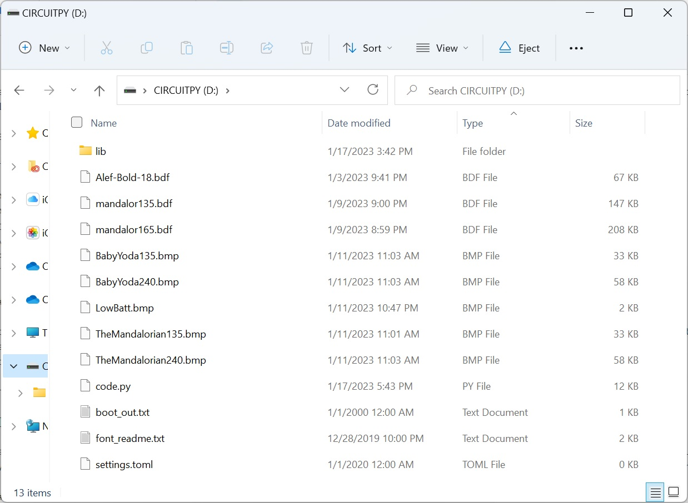 
</div>

Make sure you let the copy finish before you remove the USB cable or reset the board, or your system could be corrupted. It could take up to 90 seconds or more on some systems. If that happens, please read the [troubleshooting page](https://learn.adafruit.com/adafruit-esp32-s3-feather/troubleshooting)

### 3. Solder the LCD

You will need to solder 8 wires to the LCD, and both LCDs have the same pinout. This is low power, so 26 gauge wire will do just fine. Adafruit has a great [soldering guide](https://learn.adafruit.com/adafruit-guide-excellent-soldering) if you are new to soldering. Use a good [solder with flux](https://www.amazon.com/Kester-83-4000-0000-SN60PB40-Solder-Diameter/dp/B00068IJNQ/ref=sr_1_1_sspa?crid=HV62AJBMHEQL&keywords=kester%20solder&qid=1672809327&sprefix=kester%20solde%2Caps%2C150&sr=8-1-spons&psc=1&spLa=ZW5jcnlwdGVkUXVhbGlmaWVyPUFBOVQySE9NM0NUWFkmZW5jcnlwdGVkSWQ9QTA0MjY2MjMyUUM3MVFDVE1PQ0VPJmVuY3J5cHRlZEFkSWQ9QTA1MzAzNDExVFBJMFlEODk1R0pBJndpZGdldE5hbWU9c3BfYXRmJmFjdGlvbj1jbGlja1JlZGlyZWN0JmRvTm90TG9nQ2xpY2s9dHJ1ZQ%3D%3D&fbclid=IwAR1TzWoo-5M7vXR6Mkk5zdzJNutSWpBW5ey3jyDTxUd5Cx8i-isY_OFEHnw) in it. That makes it much easier to make a good solder joint, and you only need to touch the parts for a second or two.

The pink wire to the LIT pin on the display is optional, and only needed if you want to control the backlight level. It will be required in the future deep sleep feature which will need to turn off the display (only supported on the ESP32-S3 Feather).

#### 3a. Pre-Beskar LCD Wiring

##### Wiring the 1.14" Display to the Adafruit ESP32-S3 Feather
<div align="center">
  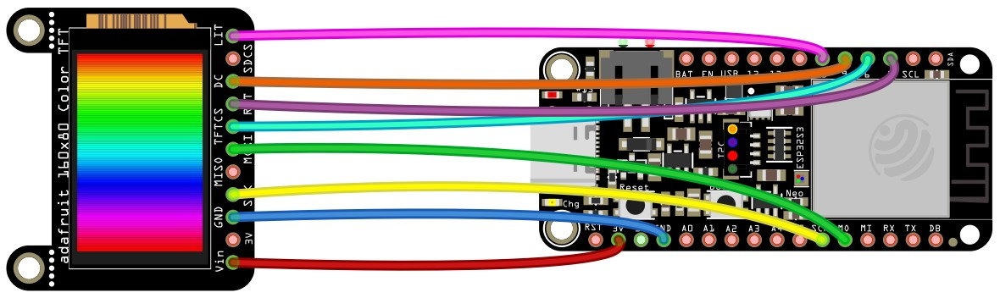
</div>

##### Wiring the 1.14" Display to the Adafruit Feather M4 Express
<div align="center">
  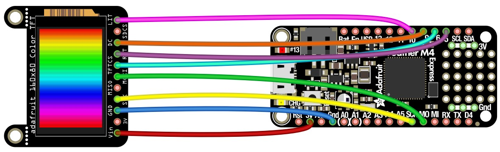
</div>

##### Wiring the 1.14" Display to the Adafruit ItsyBitsy M4 Express
<div align="center">
  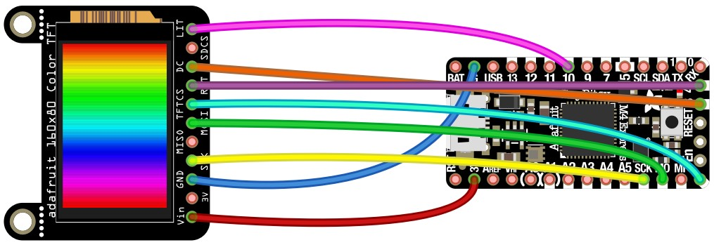
</div>

##### Wiring the 1.14" Display to the Adafruit ItsyBitsy RP2040
<div align="center">
  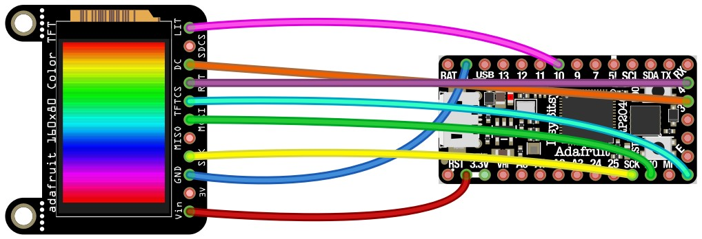
</div>

##### Wiring the 1.14" Display to the Raspberry Pi Pico RP2040
<div align="center">
  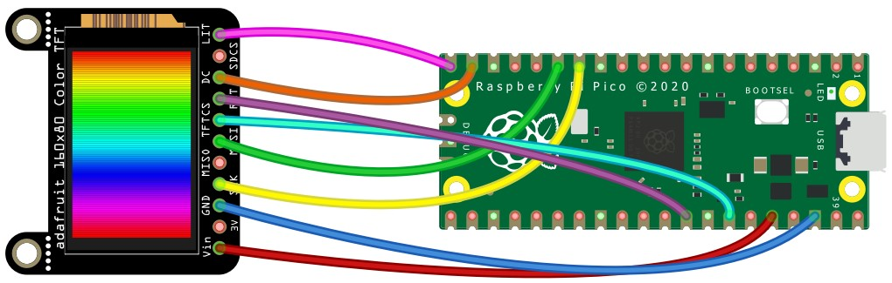
</div>

#### 3b. Beskar LCD Wiring

##### Wiring the 1.3" Display to the Adafruit ESP32-S3 Feather
<div align="center">
  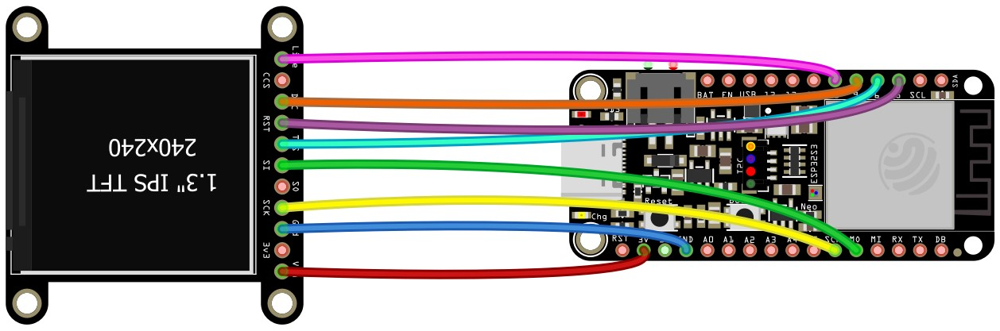
</div>

##### Wiring the 1.3" Display to the Adafruit Feather M4 Express
<div align="center">
  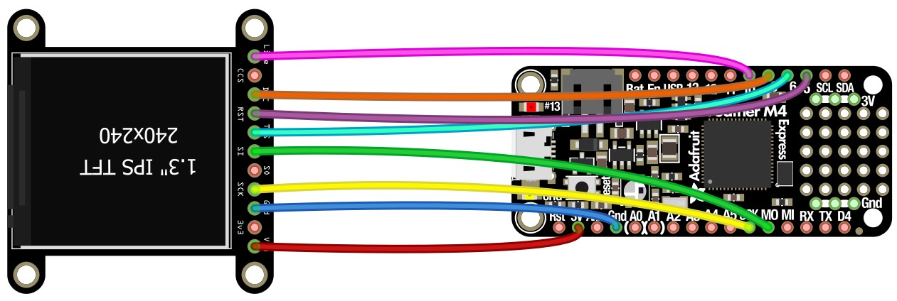
</div>

##### Wiring the 1.3" Display to the Adafruit ItsyBitsy M4 Express
<div align="center">
  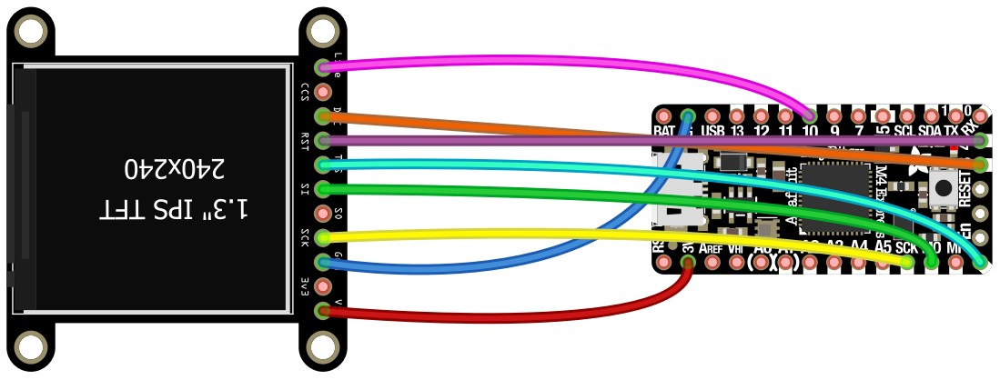
</div>

##### Wiring the 1.3" Display to the Adafruit ItsyBitsy RP2040
<div align="center">
  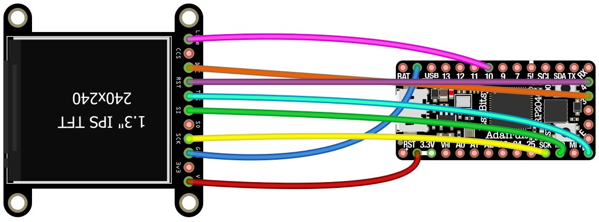
</div>

##### Wiring the 1.3" Display to the Raspberry Pi Pico RP2040
<div align="center">
  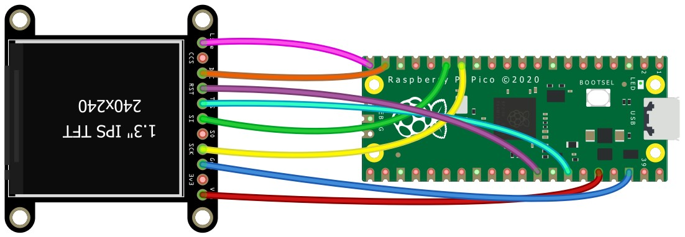
</div>

For the Beskar display you will need to cut off the mounting tabs with a pair of side cutters. Be careful that you do not cut the main board in the process.

<div align="center">
  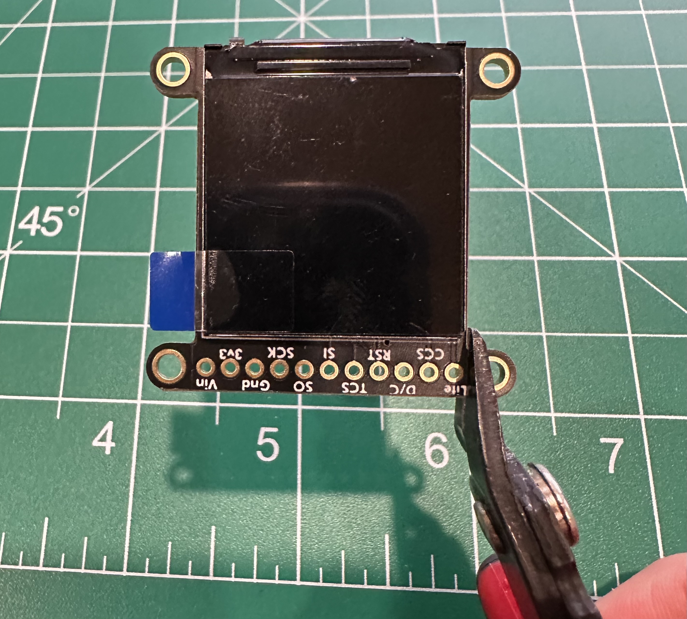  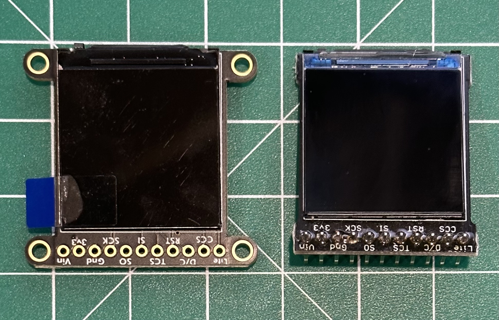
</div>

### 4. Power the board

You have a couple of different options to power the board:

* Connect a USB power source to the USB port on the board. Boards with an onboard charger will not charge anything connected to USB. Battery monitoring will not work when powered via USB.
* Connect a LiPoly battery to the board

If you choose a board that does not have an on-board battery charger you will have to buy a separate [charger](https://www.adafruit.com/product/1904) to charge the battery (unless you use the backpack board in the next paragraph). With an on-board charger it will charge when you have power to USB. 

For boards that do not have a battery connector you can solder on a battery [backpack board](https://www.adafruit.com/product/2124) which will also charge the battery. If you don't want an onboard charger simply solder a [battery pigtail](https://www.adafruit.com/product/3814) to the board (match the red and black wires in the diagram below). Another option is power the board via any USB battery or power device if you prefer that (connected to the USB port).

Here's a wiring diagram for the ItsyBitsy (all versions are the same wiring) or the Raspberry Pi with the Backpack Add-on.
<div align="center">
  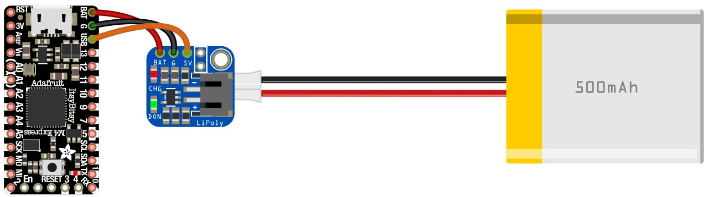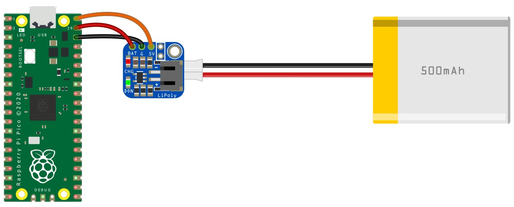
</div>

If you are not using an Adafruit battery then you need to check the polarity of the battery wiring. The black wire should be closest to the USB connector, see the picture below for the correct polarity on boards that have a LiPoly connector.

<div align="center">
  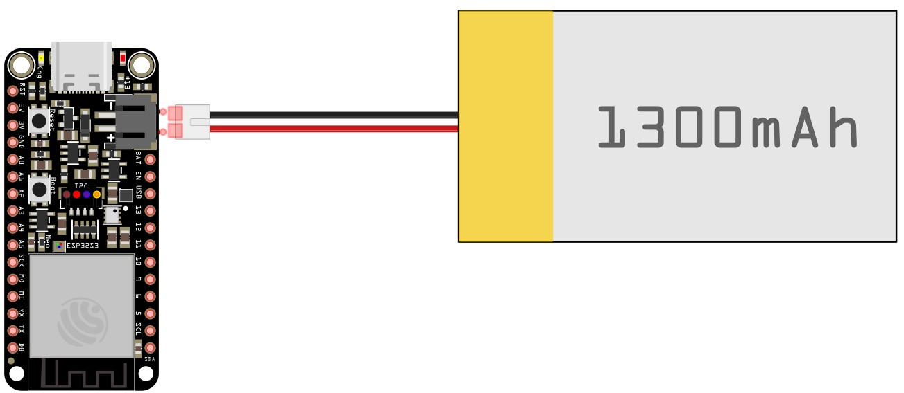
</div>

##### Jumper for monitoring battery voltage

The ItsyBitsy and Raspberry Pi boards need an extra jumper wire to read the LiPoly battery voltage. Change the `BATTERY_MON` setting to 1 to enable reading the battery voltage and display the low battery icon.

Here are the jumper wire locations for the ItsyBitsy M4 Express, ItsyBitsy RP2040, and Raspberry Pi Pico boards

<div align="center">
  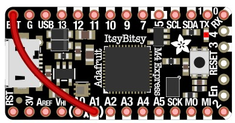
  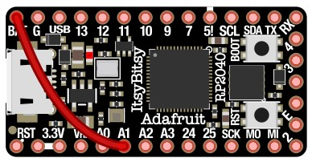
  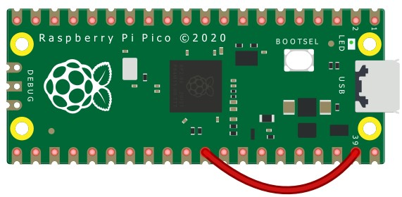
</div>

## Latest Mandalorian Font

I have an in depth page on the fonts and sequence [here](https://github.com/Breazile/MandoPuter/blob/master/MandoaDecode.md).

The font used on the show is different from the font in the original Star Wars movies. The best match for the font is the [Mando AF](https://aurekfonts.github.io/?font=MandoAF) font. The L characters is not correct (should look like the inverted V character), and the J and X characters are duplicates of characters before them. I have modified this font and fixed the characters - [MandoPuter.sfd](https://github.com/Breazile/MandoPuter/blob/master/MandoPuter.sfd). Bitmap fonts in the ZIP file are now correct with non-proportional spacing as of 1/17/2023.

Adafruit has a guide on how to convert TTF or OTF fonts to BDF (bitmap) fonts that MandoPuter uses. [Custom Fonts for CircuitPython Displays](https://learn.adafruit.com/custom-fonts-for-pyportal-circuitpython-display/conversion)

Maybe we will find hidden meaning in the sequence. Mandalorian language reference here : https://www.mandoa.org/

## Where can I get help?

Click the [Issues](https://github.com/Breazile/MandoPuter/issues) link at the top of this page and file a new issue.

## Troubleshooting

If you do not see anything on the display, check the onboard LED to see if the code is running properly. If you see a blue or red flashing LED then there is an error in the code. If that happens try updating CircuitPython, and extract all of the files from the ZIP release to the CIRCUITPY drive. You might also have an error in the code (code.py) if you have made a mistake, so try using the unmodified one from the ZIP file. 

You can also power the board from the USB port, so try running it with the battery removed to isolate a battery related problem.

Other brands of LCDs may require different polarity in the SPI communication signaling. Please contact me if you need help programming an alternate display.

If you need help click the [Issues](https://github.com/Breazile/MandoPuter/issues) link at the top of this page and file a new issue.

## Want to know more?

Check out this [getting started guide](https://learn.adafruit.com/welcome-to-circuitpython/overview) on CircuitPython. There's also a [CircuitPython essentials guide](https://learn.adafruit.com/circuitpython-essentials/circuitpython-essentials) that good to read through.

- [CircuitPython Downloads](https://circuitpython.org/downloads)
- [Adafruit CircuitPython Library Bundle](https://github.com/adafruit/Adafruit_CircuitPython_Bundle/tree/master/libraries)
- [CircuitPython GitHub](https://github.com/adafruit/circuitpython)
- [CircuitPython internal libraries](https://github.com/adafruit/circuitpython/tree/master/shared-bindings)

You should be ready to go. The system should run once the file is saved, and you should see the font look like this:

<div align="center">
  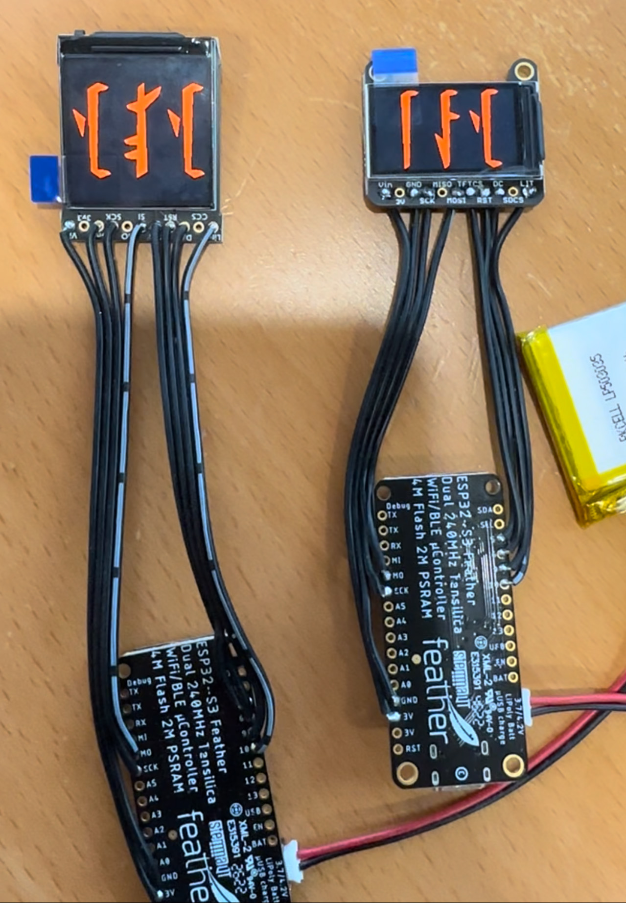
</div>
